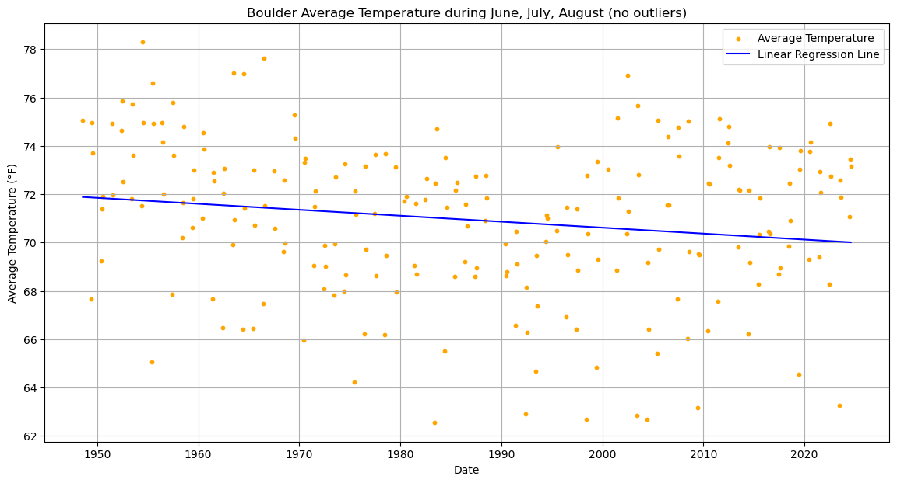

# Colorado Snowfall Analysis and XCast Toolkit Integration

## Team
- [Richard Roberson](https://github.com/richardr1126)
- [Sam Harris](https://github.com/srharris11)
- [Sanghyun Shim](https://github.com/ssh2012)

## Overview

This repository includes the Colorado Snowfall Analysis Project, which explores historical snowfall and temperature trends across key Colorado cities, and provides instructions for installing and utilizing the XCast toolkit for advanced climate forecasting.

## Acknowledgements

- Weather data sourced from [NOAA CDO (Climate Data Online)](https://www.ncdc.noaa.gov/cdo-web/).
- XCast toolkit by Kyle Hall & Nachiketa Acharya.

### What is XCast?
XCast is a free and open-source climate forecasting toolkit developed by Kyle Hall & Nachiketa Acharya. It empowers forecasters and earth scientists to apply state-of-the-art postprocessing techniques to gridded datasets. Learn more on the [XCast documentation site](https://xcast-lib.github.io/).


---

### Data Cleaning

Each dataset was cleaned for uniformity and accuracy:
- Replaced missing or erroneous values (e.g., `-998`, `-999`) with `NaN`.
- Standardized column names (e.g., `SNWD` to `snowcover`).
- Created unified `date` columns.
- Then drop any remaining NaN values.

<p float="left">
  
  
  
  
</p>


### Visualizations

All plots are saved under `plots/` in subfolders for each city:
- Daily and cumulative snowfall trends.
- Temperature trends with regression analysis.
- Seasonal and monthly summaries.
Important plots:

<p float="left">
  
  
  
  
</p>

---

## Installation

### Installing XCast

To set up an environment with Jupyter Notebook for XCast, use:

```bash
conda env create -f xcast_env.yml
conda activate xcast_env
python -m ipykernel install --user --name=xcast_env
```

You can then select `xcast_env` as the kernel in Jupyter Notebook.

> **Note**: I have provided yml to build conda env due official installation package errors. If you encounter any issues, please refer to the official [XCast documentation](https://xcast-lib.github.io/)

### Running Snowfall Analysis

1. Clone the repository.
2. Ensure cleaned weather data files are in the `data/` folder.
3. Use the Python notebooks to run city-specific analyses
4. Visualizations will be generated in `plots/`.

---

## License

Distributed under the MIT License. See `LICENSE` for more information.